# データモデル（改訂版 v2.2）

> 改訂日: 2026-05-22
> 前提スタック: PostgreSQL 15+ (Supabase) / Drizzle ORM
> v2 → v2.1: Codex 総合レビュー 19 指摘 + 3 追加判断（MVP 定義 / 案件単位招待 / 楽観排他）反映。
> **v2.1 → v2.2: Codex 最終レビュー 5 新規問題を反映**（未登録業者招待 / 先着受注 DB 関数 / 通知配送 KPI / マイグレーション順序 / LINE-SMS Phase 整理）。

## 0. 改訂方針

1. **販売会社（法人）単位 SaaS** — `companies` を最上位とし、**全テーブルに `company_id NOT NULL` FK**（中間/子テーブル含む）
2. **状態遷移と履歴**は別テーブルで append-only 管理（`*_status_history`）
3. **通知は outbox 方式** — DB に `notification_outbox` を持ち、Inngest はその配送 worker（`FOR UPDATE SKIP LOCKED` で取得）
4. **portal 通知は inbox 分離** — `vendor_portal_inbox` を別テーブル化、`notification_deliveries` は配送ログ専用
5. **予約枠排他**は exclusion constraint + tstzrange + gist で DB が強制
6. **業者ポータル**は `vendor_users` 分離、認可は `vendor_company_memberships` + `transport_orders.vendor_id` 照合
7. **案件単位招待**は `transport_order_invitations` テーブルで管理（複数業者打診・スポット業者）
8. **顧客は Supabase Auth user にしない** — `customer_reservation_tokens` で本人確認
9. **タイムゾーン**: 全 timestamp は `timestamptz` で UTC 保存、表示は JST 固定
10. **M2M 正規化** — 配列カラム禁止、関連テーブル化
11. **soft delete** — 主要テーブルに `deleted_at timestamptz`
12. **楽観排他** — 予約・整備伝票・店間依頼など重要テーブルに `version int` を追加し IF-MATCH 更新
13. **監査ログ** — `audit_logs` で全変更を append-only 記録（テーブル別 PII redaction policy 適用）
14. **movement_type 整合性** — DB CHECK 制約でパターン別 null/非 null を固定

---

## 1. ER 図（Mermaid、v2.1）

```mermaid
erDiagram
  companies ||--o{ stores : has
  companies ||--o{ users : employs
  companies ||--o{ work_categories : owns
  companies ||--o{ work_menus : owns
  companies ||--o{ vendors : has_vendor_master
  companies ||--o{ statuses : defines
  companies ||--o{ reservation_settings : configures
  companies ||--o{ notification_rules : configures
  companies ||--o{ audit_logs : auditing

  stores ||--o{ store_business_hours : has
  stores ||--o{ store_holidays : has
  stores ||--o{ lanes : has
  stores ||--o{ reservations : hosts

  lane_types ||--o{ lanes : classifies
  lanes ||--o{ lane_work_menus : supports
  lanes ||--o{ lane_working_hours : has

  work_categories ||--o{ work_menus : groups
  work_menus ||--o{ lane_work_menus : assignable_to

  vehicles }o--o{ vehicle_ownerships : owned_via
  customers ||--o{ vehicle_ownerships : owns
  customers ||--o{ customer_reservation_tokens : authenticated_via

  service_tickets }o--|| vehicles : about
  service_tickets ||--o{ reservations : booked_via
  service_tickets ||--o| customers : for
  service_tickets ||--o{ transport_orders : ships_via

  reservations ||--o{ reservation_status_history : history
  transport_orders ||--o{ transport_order_status_history : history
  transport_orders ||--o{ transport_order_change_logs : diff
  transport_orders ||--o{ transport_order_vendor_attempts : tried
  transport_orders ||--o{ transport_order_invitations : invited

  vendors ||--o{ vendor_users : employs
  vendors ||--o{ vendor_company_memberships : memberships
  vendors ||--o{ vendor_service_areas : serves
  vendors ||--o{ vendor_available_stores : serves_stores
  vendors ||--o{ vendor_available_days : serves_days
  vendors ||--o{ transport_orders : assigned
  vendors ||--o{ transport_order_invitations : invited_to

  transport_orders ||--o{ notification_outbox : triggers
  notification_outbox ||--o{ notification_deliveries : delivered_as
  vendor_users ||--o{ vendor_portal_inbox : reads

  users ||--|| roles : has
  roles ||--o{ permissions : grants
```



cardinality 注：1 車両は複数整備伝票を持ち得るため `service_tickets }o--|| vehicles`。

---

## 2. 命名規約・共通フィールド

### 命名規約
- テーブル名は **複数形 snake_case**（`reservations`, `transport_orders`）
- 履歴テーブルは `*_status_history` / `*_change_logs`
- 中間テーブルは `<owner>_<related>`（`lane_work_menus`）
- enum は string column + CHECK 制約（PG enum は alter が辛いので避ける）

### 共通フィールド（全テーブル）

| カラム | 型 | 説明 |
|---|---|---|
| `id` | `uuid` (`gen_random_uuid()`) | PK |
| `company_id` | `uuid NOT NULL` | **テナント FK（`companies` テーブル本体以外の全テーブル必須）** |
| `created_at` | `timestamptz NOT NULL DEFAULT now()` | UTC |
| `updated_at` | `timestamptz NOT NULL DEFAULT now()` | UTC、トリガで自動更新 |
| `deleted_at` | `timestamptz NULL` | soft delete（主要テーブルのみ） |
| `created_by_user_id` | `uuid NULL` | 作成者監査 |
| `updated_by_user_id` | `uuid NULL` | 最終更新者監査 |
| `version` | `int NOT NULL DEFAULT 1` | **楽観排他用**（重要テーブルのみ） |

### `version` カラム適用テーブル

楽観排他で保護する重要テーブル：
- `reservations`
- `service_tickets`
- `transport_orders`
- `vendors`
- `customers`
- `vehicles`

UPDATE 時は `WHERE id = ? AND version = ?` の IF MATCH 更新 + `SET version = version + 1` で行う。一致しない場合は `OptimisticLockError` として上位へ。

### enum 値の管理
- 業務的に増減するもの（ステータス・通知方法）は `statuses` / マスターテーブル
- 構造的に固定するもの（reservation_type, channel）は string + CHECK 制約

---

## 3. テナント・認証

### 3.1 `companies`

販売会社（法人）= 最上位テナント。**唯一 `company_id` を持たないテーブル**。

| カラム | 型 | 説明 |
|---|---|---|
| `id` | uuid PK | |
| `name` | text NOT NULL | |
| `code` | text UNIQUE | 略称・スラッグ |
| `time_zone` | text NOT NULL DEFAULT 'Asia/Tokyo' | 将来の海外展開用 |
| `default_currency` | text NOT NULL DEFAULT 'JPY' | |
| `is_active` | bool NOT NULL DEFAULT true | |
| `plan` | text | SaaS プラン |
| `created_at` / `updated_at` / `deleted_at` | timestamptz | |

### 3.2 `users`

社内ユーザー（店舗スタッフ・本部管理者・工場長）。Supabase Auth と 1:1。

| カラム | 型 | 説明 |
|---|---|---|
| `id` | uuid PK | `auth.users.id` と一致（trigger で同期） |
| `company_id` | uuid NOT NULL FK | |
| `email` | text NOT NULL | |
| `name` | text NOT NULL | |
| `role_id` | uuid NOT NULL FK | `roles` |
| `default_store_id` | uuid NULL FK | 主所属店舗 |
| `is_active` | bool NOT NULL DEFAULT true | 退職フラグ |

UNIQUE(`company_id`, `email`)

#### 3.2.1 Supabase Auth 同期 trigger

```sql
-- auth.users INSERT 時に users 行を作成する trigger は使わず、
-- onboarding service 関数で明示的に作成する（company_id 等を入れるため）。
-- ただし削除時の整合性は trigger で保証：
CREATE OR REPLACE FUNCTION sync_user_delete() RETURNS trigger
LANGUAGE plpgsql SECURITY DEFINER AS $$
BEGIN
  UPDATE public.users SET deleted_at = now(), is_active = false WHERE id = OLD.id;
  RETURN OLD;
END;
$$;
CREATE TRIGGER on_auth_user_deleted
  AFTER DELETE ON auth.users
  FOR EACH ROW EXECUTE FUNCTION sync_user_delete();
```

### 3.3 `user_store_memberships`

ユーザーと店舗の N:N。

| カラム | 型 | 説明 |
|---|---|---|
| `company_id` | uuid NOT NULL FK | **明示保持** |
| `user_id` | uuid FK | |
| `store_id` | uuid FK | |
| `is_primary` | bool | |
| 共通フィールド | | |

PK(`user_id`, `store_id`)

### 3.4 `roles`

| カラム | 型 | 説明 |
|---|---|---|
| `id` | uuid PK | |
| `company_id` | uuid NULL | NULL = システム標準ロール（全テナント共通シード） |
| `key` | text NOT NULL | `headquarters_admin` / `store_manager` / `factory_lead` / `store_staff` / `vendor_user` / `customer` |
| `name` | text NOT NULL | 表示名 |
| `description` | text | |

UNIQUE(`company_id`, `key`)

**RLS 補足**: `company_id IS NULL` のシステム標準ロールは全テナントから SELECT 可、UPDATE/DELETE は禁止（superuser のみ）。

### 3.5 `permissions`

| カラム | 型 | 説明 |
|---|---|---|
| `role_id` | uuid FK | |
| `permission_key` | text NOT NULL | 例: `reservation.create`, `vendor.notify`, `settings.lanes.write` |
| `allowed` | bool NOT NULL | |

PK(`role_id`, `permission_key`)

### 3.6 `vendor_users`

業者ユーザー = 業者ポータルにログインする外部アカウント。`users` とは別テーブル。

| カラム | 型 | 説明 |
|---|---|---|
| `id` | uuid PK | `auth.users.id` と一致（trigger で同期） |
| `vendor_id` | uuid NOT NULL FK | |
| `company_id` | uuid NOT NULL FK | **業者の専属会社（vendors.company_id と一致）** |
| `email` | text NOT NULL | |
| `name` | text NOT NULL | |
| `is_active` | bool NOT NULL DEFAULT true | |
| `last_login_at` | timestamptz | |
| 共通フィールド | | |

UNIQUE(`email`)

#### 3.6.1 vendor_id ⇔ company_id 整合性 trigger

```sql
CREATE OR REPLACE FUNCTION enforce_vendor_user_tenancy() RETURNS trigger
LANGUAGE plpgsql AS $$
DECLARE
  v_company_id uuid;
BEGIN
  SELECT company_id INTO v_company_id FROM vendors WHERE id = NEW.vendor_id;
  IF v_company_id IS NULL OR v_company_id != NEW.company_id THEN
    RAISE EXCEPTION 'vendor_users.company_id must match vendors.company_id';
  END IF;
  RETURN NEW;
END;
$$;
CREATE TRIGGER trg_vendor_user_tenancy
  BEFORE INSERT OR UPDATE ON vendor_users
  FOR EACH ROW EXECUTE FUNCTION enforce_vendor_user_tenancy();
```

### 3.7 `customer_reservation_tokens`

| カラム | 型 | 説明 |
|---|---|---|
| `id` | uuid PK | |
| `company_id` | uuid NOT NULL FK | |
| `reservation_id` | uuid NOT NULL FK | |
| `customer_id` | uuid NOT NULL FK | |
| `token_hash` | text NOT NULL UNIQUE | SHA-256 hash |
| `purpose` | text NOT NULL CHECK IN ('view','modify','cancel') | |
| `expires_at` | timestamptz NOT NULL | |
| `used_at` | timestamptz | 一度使ったら無効化（modify/cancel） |

INDEX(`expires_at`) for cleanup

---

## 4. 店舗・営業時間

### 4.1 `stores`

| カラム | 型 | 説明 |
|---|---|---|
| `id` | uuid PK | |
| `company_id` | uuid NOT NULL FK | |
| `name` | text NOT NULL | |
| `address` | text | |
| `phone` | text | |
| `has_pit` | bool NOT NULL DEFAULT false | |
| `accepts_reservations` | bool NOT NULL DEFAULT true | |
| `display_order` | int NOT NULL DEFAULT 0 | |
| `is_active` | bool NOT NULL DEFAULT true | |
| 共通フィールド | | |

UNIQUE(`company_id`, `name`)

### 4.2 `store_business_hours`

| カラム | 型 | 説明 |
|---|---|---|
| `company_id` | uuid NOT NULL FK | |
| `store_id` | uuid NOT NULL FK | |
| `day_of_week` | smallint NOT NULL CHECK 0-6 | 0=Sun |
| `open_at` | time NOT NULL | |
| `close_at` | time NOT NULL | |
| `is_closed` | bool NOT NULL DEFAULT false | |

PK(`store_id`, `day_of_week`)

### 4.3 `store_holidays`

| カラム | 型 | 説明 |
|---|---|---|
| `id` | uuid PK | |
| `company_id` | uuid NOT NULL FK | |
| `store_id` | uuid NOT NULL FK | |
| `holiday_date` | date NOT NULL | |
| `reason` | text | |

UNIQUE(`store_id`, `holiday_date`)

---

## 5. レーン・作業

### 5.1 `lane_types`

| カラム | 型 | 説明 |
|---|---|---|
| `id` | uuid PK | |
| `company_id` | uuid NOT NULL FK | |
| `key` | text NOT NULL | `maintenance` / `heavy` / `general` / `inspection` / `diagnosis` / `predelivery` / `outsourcing` |
| `name` | text NOT NULL | |
| `display_order` | int | |
| `is_active` | bool | |

UNIQUE(`company_id`, `key`)

### 5.2 `lanes`

| カラム | 型 | 説明 |
|---|---|---|
| `id` | uuid PK | |
| `company_id` | uuid NOT NULL FK | |
| `store_id` | uuid NOT NULL FK | |
| `lane_type_id` | uuid NOT NULL FK | |
| `name` | text NOT NULL | |
| `concurrent_capacity` | int NOT NULL DEFAULT 1 | |
| `display_order` | int | |
| `is_active` | bool | |
| `notes` | text | |
| 共通フィールド | | |

### 5.3 `lane_working_hours`

| カラム | 型 | 説明 |
|---|---|---|
| `company_id` | uuid NOT NULL FK | |
| `lane_id` | uuid NOT NULL FK | |
| `day_of_week` | smallint CHECK 0-6 | |
| `start_at` | time | |
| `end_at` | time | |
| `is_closed` | bool | |

PK(`lane_id`, `day_of_week`)

### 5.4 `lane_work_menus`（M2M）

| カラム | 型 | 説明 |
|---|---|---|
| `company_id` | uuid NOT NULL FK | |
| `lane_id` | uuid NOT NULL FK | |
| `work_menu_id` | uuid NOT NULL FK | |

PK(`lane_id`, `work_menu_id`)

### 5.5 `work_categories`

| カラム | 型 | 説明 |
|---|---|---|
| `id` | uuid PK | |
| `company_id` | uuid NOT NULL FK | |
| `name` | text NOT NULL | |
| `display_order` | int | |
| `is_active` | bool | |

UNIQUE(`company_id`, `name`)

### 5.6 `work_menus`

| カラム | 型 | 説明 |
|---|---|---|
| `id` | uuid PK | |
| `company_id` | uuid NOT NULL FK | |
| `work_category_id` | uuid NOT NULL FK | |
| `name` | text NOT NULL | |
| `standard_duration_minutes` | int NOT NULL | |
| `default_lane_type_id` | uuid FK | |
| `required_slot_count` | int NOT NULL DEFAULT 1 | |
| `buffer_minutes` | int NOT NULL DEFAULT 0 | |
| `visible_to_customers` | bool | |
| `visible_to_staff` | bool | |
| `visible_to_inter_store_reservation` | bool | |
| `allows_free_input` | bool | |
| `is_active` | bool | |
| `display_order` | int | |
| `notes` | text | |

UNIQUE(`company_id`, `work_category_id`, `name`)

---

## 6. 予約・整備伝票・車両

### 6.1 `service_tickets`

| カラム | 型 | 説明 |
|---|---|---|
| `id` | uuid PK | |
| `company_id` | uuid NOT NULL FK | |
| `ticket_number` | text NOT NULL | |
| `vehicle_id` | uuid NOT NULL FK | 1 車両に複数伝票 OK |
| `customer_id` | uuid NULL FK | |
| `reception_store_id` | uuid NOT NULL FK | |
| `work_store_id` | uuid NULL FK | |
| `work_category_id` | uuid NULL FK | |
| `work_menu_id` | uuid NULL FK | |
| `work_detail` | text | |
| `scheduled_in_at` | timestamptz | |
| `scheduled_out_at` | timestamptz | |
| `actual_in_at` | timestamptz | |
| `actual_out_at` | timestamptz | |
| `work_started_at` | timestamptz | |
| `work_finished_at` | timestamptz | |
| `assigned_user_id` | uuid FK | |
| `status_id` | uuid NOT NULL FK | `statuses` (status_type=service) |
| `estimated_amount_minor` | bigint | 最小通貨単位 |
| `billed_amount_minor` | bigint | |
| `currency` | text NOT NULL DEFAULT 'JPY' | |
| `tax_included` | bool NOT NULL DEFAULT true | |
| `notes` | text | |
| `version` | int NOT NULL DEFAULT 1 | 楽観排他 |
| 共通フィールド | | |

UNIQUE(`company_id`, `ticket_number`)

### 6.2 `reservations`

| カラム | 型 | 説明 |
|---|---|---|
| `id` | uuid PK | |
| `company_id` | uuid NOT NULL FK | |
| `service_ticket_id` | uuid NULL FK | |
| `reservation_type` | text NOT NULL CHECK IN ('customer','inter_store') | |
| `store_id` | uuid NOT NULL FK | |
| `lane_id` | uuid NULL FK | |
| `work_menu_id` | uuid NULL FK | |
| `work_detail` | text | |
| `start_at` | timestamptz NOT NULL | |
| `end_at` | timestamptz NOT NULL | |
| `standard_duration_minutes` | int | |
| `buffer_minutes` | int | |
| `estimated_duration_minutes` | int | |
| `status_id` | uuid NOT NULL FK | |
| `assigned_user_id` | uuid FK | |
| `has_inter_store_transport` | bool NOT NULL DEFAULT false | |
| `is_double_booking` | bool NOT NULL DEFAULT false | |
| `tentative_expires_at` | timestamptz | |
| `notes` | text | |
| `version` | int NOT NULL DEFAULT 1 | 楽観排他 |
| 共通フィールド | | |

#### 6.2.1 排他制約

```sql
ALTER TABLE reservations ADD CONSTRAINT reservations_no_overlap
  EXCLUDE USING gist (
    lane_id WITH =,
    tstzrange(start_at, end_at, '[)') WITH &&
  )
  WHERE (deleted_at IS NULL AND is_double_booking = false AND lane_id IS NOT NULL);
```

`btree_gist` 拡張は `01_extensions` で事前作成。

#### 6.2.2 楽観排他更新例

```sql
UPDATE reservations
  SET status_id = $1, version = version + 1, updated_at = now()
  WHERE id = $2 AND version = $3 AND deleted_at IS NULL;
-- 更新行数 0 → OptimisticLockError
```

### 6.3 `reservation_status_history`

| カラム | 型 | 説明 |
|---|---|---|
| `id` | uuid PK | |
| `company_id` | uuid NOT NULL FK | |
| `reservation_id` | uuid NOT NULL FK | |
| `from_status_id` | uuid NULL FK | |
| `to_status_id` | uuid NOT NULL FK | |
| `changed_by_user_id` | uuid NULL FK | |
| `reason` | text | |
| `changed_at` | timestamptz NOT NULL DEFAULT now() | |

INDEX(`reservation_id`, `changed_at`)

### 6.4 `vehicles`

| カラム | 型 | 説明 |
|---|---|---|
| `id` | uuid PK | |
| `company_id` | uuid NOT NULL FK | |
| `vehicle_management_number` | text | |
| `model_name` | text | |
| `model_year` | smallint | |
| `license_plate` | text | |
| `vin` | text | |
| `current_store_id` | uuid FK | |
| `vehicle_status` | text | |
| `notes` | text | |
| `version` | int NOT NULL DEFAULT 1 | 楽観排他 |
| 共通フィールド | | |

UNIQUE(`company_id`, `vin`) NULLS NOT DISTINCT

### 6.5 `vehicle_ownerships`

| カラム | 型 | 説明 |
|---|---|---|
| `id` | uuid PK | |
| `company_id` | uuid NOT NULL FK | |
| `vehicle_id` | uuid NOT NULL FK | |
| `customer_id` | uuid NOT NULL FK | |
| `since` | date NOT NULL | |
| `until` | date NULL | |

INDEX(`vehicle_id`), INDEX(`customer_id`)

### 6.6 `customers`

| カラム | 型 | 説明 |
|---|---|---|
| `id` | uuid PK | |
| `company_id` | uuid NOT NULL FK | |
| `name` | text NOT NULL | |
| `phone` | text | |
| `email` | text | |
| `verified_email` | bool NOT NULL DEFAULT false | |
| `verified_phone` | bool NOT NULL DEFAULT false | |
| `notes` | text | |
| `version` | int NOT NULL DEFAULT 1 | 楽観排他 |
| 共通フィールド | | |


#### 6.6.1 phone_normalized + partial GIN index (v2.2 + 2026-05-23 追加)

全文検索 (Item 7) で電話番号検索を E.164 / ハイフン除去で正規化するためのカラムと、全 GIN index に PII 配慮の partial 条件 (`WHERE deleted_at IS NULL`) を必須化。

```sql
ALTER TABLE customers
  ADD COLUMN phone_normalized TEXT GENERATED ALWAYS AS (
    regexp_replace(coalesce(phone, ''), '[^0-9+]', '', 'g')
  ) STORED;

-- 顧客検索 (partial GIN)
CREATE INDEX idx_customers_search_trgm
  ON customers USING gin (
    (coalesce(name, '') || ' ' || coalesce(name_kana, '') || ' ' || coalesce(phone_normalized, '')) gin_trgm_ops
  )
  WHERE deleted_at IS NULL;

-- 車両検索 (partial GIN)
CREATE INDEX idx_vehicles_search_trgm
  ON vehicles USING gin (
    (coalesce(plate_number, '') || ' ' || coalesce(vin, '') || ' ' || coalesce(notes, '')) gin_trgm_ops
  )
  WHERE deleted_at IS NULL;

-- 整備伝票検索 (partial GIN)
CREATE INDEX idx_service_tickets_search_trgm
  ON service_tickets USING gin (
    (coalesce(customer_request, '') || ' ' || coalesce(completion_note, '')) gin_trgm_ops
  )
  WHERE deleted_at IS NULL;
```

検索 API 必須要件:
- 必ず `WHERE company_id = current_company_id()` を先に絞る (RLS で多層防御)
- 検索ログテーブル (`search_query_logs` 等) に検索文字列を保存しない (PII 含む可能性)

---

## 7. 業者・通知

### 7.1 `vendors`

| カラム | 型 | 説明 |
|---|---|---|
| `id` | uuid PK | |
| `company_id` | uuid NOT NULL FK | デフォルト所属会社（専属） |
| `name` | text NOT NULL | |
| `contact_person_name` | text | |
| `email` | text | |
| `phone` | text | |
| `notification_method` | text NOT NULL CHECK IN ('email','portal','both') DEFAULT 'both' | |
| `is_shared` | bool NOT NULL DEFAULT false | true=他社からも依頼可 |
| `priority` | int DEFAULT 0 | |
| `is_active` | bool | |
| `display_order` | int | |
| `notes` | text | |
| `version` | int NOT NULL DEFAULT 1 | 楽観排他 |
| 共通フィールド | | |

### 7.2 `vendor_company_memberships`

| カラム | 型 | 説明 |
|---|---|---|
| `id` | uuid PK | |
| `vendor_id` | uuid NOT NULL FK | |
| `company_id` | uuid NOT NULL FK | |
| `is_enabled` | bool NOT NULL DEFAULT true | |
| `contract_started_at` | date | |
| `contract_ended_at` | date | |
| 共通フィールド | | |

UNIQUE(`vendor_id`, `company_id`)

#### 7.2.1 is_shared CHECK 制約

```sql
CREATE OR REPLACE FUNCTION enforce_membership_shared() RETURNS trigger
LANGUAGE plpgsql AS $$
DECLARE
  v_is_shared bool;
  v_owner_company uuid;
BEGIN
  SELECT is_shared, company_id INTO v_is_shared, v_owner_company FROM vendors WHERE id = NEW.vendor_id;
  -- 自社（専属会社）への membership は always OK
  IF v_owner_company = NEW.company_id THEN
    RETURN NEW;
  END IF;
  -- 他社への membership は is_shared=true が必須
  IF NOT v_is_shared THEN
    RAISE EXCEPTION 'Cannot add membership for non-shared vendor';
  END IF;
  RETURN NEW;
END;
$$;
CREATE TRIGGER trg_membership_shared
  BEFORE INSERT OR UPDATE ON vendor_company_memberships
  FOR EACH ROW EXECUTE FUNCTION enforce_membership_shared();
```

### 7.3 `vendor_service_areas`

| カラム | 型 | 説明 |
|---|---|---|
| `company_id` | uuid NOT NULL FK | |
| `vendor_id` | uuid NOT NULL FK | |
| `area_code` | text NOT NULL | |

PK(`vendor_id`, `area_code`)

### 7.4 `vendor_available_stores`

| カラム | 型 | 説明 |
|---|---|---|
| `company_id` | uuid NOT NULL FK | |
| `vendor_id` | uuid NOT NULL FK | |
| `store_id` | uuid NOT NULL FK | |

PK(`vendor_id`, `store_id`)

### 7.5 `vendor_available_days`

| カラム | 型 | 説明 |
|---|---|---|
| `company_id` | uuid NOT NULL FK | |
| `vendor_id` | uuid NOT NULL FK | |
| `day_of_week` | smallint CHECK 0-6 | |
| `start_at` | time | |
| `end_at` | time | |

PK(`vendor_id`, `day_of_week`)

### 7.5b `vendor_sla_overrides` (v2.2 + 2026-05-23 追加)

業者個別の応答期限 SLA を上書きするテーブル。基準 SLA は `work_categories.default_sla_minutes`、業者個別契約 (24/7 即応 / 大型車優先 / VIP 業者等) の差分をここに保存。

**重要**: SLA は「応答期限 (分)」のみ。曜日 / 営業時間 / 対応店舗 / レッカー要否は既存 `vendor_available_days` / `vendor_available_stores` / `vendor_service_capabilities` で判定し、責務を分離する。

```sql
CREATE TABLE vendor_sla_overrides (
  id                UUID PRIMARY KEY DEFAULT gen_random_uuid(),
  company_id        UUID NOT NULL REFERENCES companies(id) ON DELETE CASCADE,
  vendor_id         UUID NOT NULL REFERENCES vendors(id) ON DELETE CASCADE,
  work_category_id  UUID NOT NULL REFERENCES work_categories(id) ON DELETE CASCADE,
  sla_minutes       INT NOT NULL CHECK (sla_minutes > 0),
  effective_from    TIMESTAMPTZ NOT NULL DEFAULT now(),
  effective_until   TIMESTAMPTZ NULL,
  is_active         BOOLEAN NOT NULL DEFAULT TRUE,
  created_at        TIMESTAMPTZ NOT NULL DEFAULT now(),
  updated_at        TIMESTAMPTZ NOT NULL DEFAULT now(),
  created_by        UUID REFERENCES users(id),
  version           INT NOT NULL DEFAULT 1,
  CONSTRAINT vendor_sla_overrides_unique_per_category
    UNIQUE (company_id, vendor_id, work_category_id),
  CONSTRAINT vendor_sla_overrides_effective_range
    CHECK (effective_until IS NULL OR effective_until > effective_from)
);

CREATE INDEX idx_vendor_sla_overrides_lookup
  ON vendor_sla_overrides (company_id, vendor_id, work_category_id, is_active)
  WHERE is_active = TRUE;

-- vendor_id の company_id 整合性 trigger は §3.6.1 と同パターンで適用
```

RLS: `company_id = current_company_id()` で標準ポリシー適用。

### 7.6 `transport_orders`

| カラム | 型 | 説明 |
|---|---|---|
| `id` | uuid PK | |
| `company_id` | uuid NOT NULL FK | |
| `order_number` | text NOT NULL | |
| `service_ticket_id` | uuid NOT NULL FK | |
| `reservation_id` | uuid NULL FK | |
| `vehicle_id` | uuid NOT NULL FK | |
| `vendor_id` | uuid NULL FK | |
| `movement_type` | text NOT NULL CHECK IN ('one_way','round_trip','pickup_only','three_point') | |
| `pickup_store_id` | uuid NULL FK | |
| `delivery_store_id` | uuid NULL FK | |
| `return_store_id` | uuid NULL FK | |
| `can_drive` | bool NOT NULL DEFAULT true | |
| `tow_required` | bool NOT NULL DEFAULT false | |
| `requested_pickup_at` | timestamptz | |
| `requested_delivery_at` | timestamptz | |
| `requested_return_at` | timestamptz | |
| `scheduled_pickup_at` | timestamptz | |
| `scheduled_delivery_at` | timestamptz | |
| `scheduled_return_at` | timestamptz | |
| `picked_up_at` | timestamptz | |
| `delivered_at` | timestamptz | |
| `returned_at` | timestamptz | |
| `vendor_response` | text NOT NULL DEFAULT 'pending' CHECK IN ('pending','accepted','rejected') | |
| `vendor_response_at` | timestamptz | |
| `vendor_rejection_reason` | text | |
| `confirmation_mode` | text NOT NULL DEFAULT 'auto' CHECK IN ('auto','manual') | |
| `store_confirmed_at` | timestamptz | |
| `store_confirmed_by_user_id` | uuid FK | |
| `status_id` | uuid NOT NULL FK | |
| `notification_sent_at` | timestamptz | |
| `notes` | text | |
| `cancelled_at` | timestamptz | |
| `version` | int NOT NULL DEFAULT 1 | 楽観排他 |
| 共通フィールド | | |

UNIQUE(`company_id`, `order_number`)
INDEX(`vendor_id`, `status_id`)
INDEX(`pickup_store_id`), INDEX(`delivery_store_id`)

#### 7.6.1 movement_type 整合性 CHECK 制約

```sql
ALTER TABLE transport_orders ADD CONSTRAINT transport_orders_movement_pattern_check
  CHECK (
    (movement_type = 'one_way' AND pickup_store_id IS NOT NULL AND delivery_store_id IS NOT NULL AND return_store_id IS NULL)
    OR
    (movement_type = 'round_trip' AND pickup_store_id IS NOT NULL AND delivery_store_id IS NOT NULL AND return_store_id IS NOT NULL)
    OR
    (movement_type = 'pickup_only' AND pickup_store_id IS NOT NULL AND delivery_store_id IS NULL AND return_store_id IS NULL)
    OR
    (movement_type = 'three_point' AND pickup_store_id IS NOT NULL AND delivery_store_id IS NOT NULL AND return_store_id IS NOT NULL
      AND pickup_store_id != delivery_store_id
      AND delivery_store_id != return_store_id
      AND pickup_store_id != return_store_id)
  );
```

#### 7.6.2 tow_required 整合性

```sql
ALTER TABLE transport_orders ADD CONSTRAINT transport_orders_tow_check
  CHECK ((NOT can_drive) = tow_required OR (can_drive AND NOT tow_required));
-- can_drive=false → tow_required=true 必須
-- can_drive=true → tow_required は任意（false が通常）
```

実際の運用は can_drive=false ⇒ tow_required=true の自動セットを service 関数で行う。

### 7.7 `transport_order_status_history`

`reservation_status_history` と同構造、`transport_order_id` 参照、`company_id` 必須。

### 7.8 `transport_order_change_logs`

| カラム | 型 | 説明 |
|---|---|---|
| `id` | uuid PK | |
| `company_id` | uuid NOT NULL FK | |
| `transport_order_id` | uuid NOT NULL FK | |
| `change_type` | text NOT NULL CHECK IN ('vendor_changed','datetime_changed','cancelled','recreated','rejected_reassigned') | |
| `before_json` | jsonb | redacted |
| `after_json` | jsonb | redacted |
| `changed_by_user_id` | uuid FK | |
| `requires_notification` | bool NOT NULL DEFAULT true | |
| `notified_at` | timestamptz | |
| `created_at` | timestamptz NOT NULL DEFAULT now() | |

INDEX(`transport_order_id`, `created_at`)

### 7.9 `transport_order_vendor_attempts`

| カラム | 型 | 説明 |
|---|---|---|
| `id` | uuid PK | |
| `company_id` | uuid NOT NULL FK | |
| `transport_order_id` | uuid NOT NULL FK | |
| `vendor_id` | uuid NOT NULL FK | |
| `attempt_seq` | int NOT NULL | |
| `requested_at` | timestamptz NOT NULL | |
| `response` | text CHECK IN ('pending','accepted','rejected','timeout') | |
| `responded_at` | timestamptz | |
| `rejection_reason` | text | |

UNIQUE(`transport_order_id`, `attempt_seq`)

### 7.10 `transport_order_invitations`（案件単位招待、v2.2 で未登録業者対応）

複数業者への一斉打診、登録済みスポット業者への招待、**未登録業者への招待トークン URL 送信** を管理。

| カラム | 型 | 説明 |
|---|---|---|
| `id` | uuid PK | |
| `company_id` | uuid NOT NULL FK | |
| `transport_order_id` | uuid NOT NULL FK | |
| `vendor_id` | uuid NULL FK | **NULL = 未登録業者宛**（受諾後にバインド） |
| `invitee_email` | text NULL | 未登録業者の連絡先メール（v2.2 追加） |
| `invitee_name` | text NULL | 未登録業者の表示名（v2.2 追加） |
| `invitee_phone` | text NULL | 未登録業者の連絡電話（任意、v2.2 追加） |
| `invited_at` | timestamptz NOT NULL DEFAULT now() | |
| `invited_by_user_id` | uuid FK | |
| `invitation_token_hash` | text UNIQUE | 招待 URL の hash |
| `expires_at` | timestamptz | |
| `response` | text NOT NULL DEFAULT 'pending' CHECK IN ('pending','accepted','rejected','revoked','expired') | |
| `responded_at` | timestamptz | |
| `is_winning_bid` | bool NOT NULL DEFAULT false | 先着受注 1 件のみ true |
| `bound_vendor_id` | uuid NULL FK | 受諾時に紐付けられた vendor（v2.2、`vendor_id` が NULL 招待用） |
| `bound_vendor_user_id` | uuid NULL FK | 受諾時に紐付けられた vendor_user（v2.2） |

#### 7.10.1 整合性 CHECK

```sql
-- vendor_id か invitee_email のどちらかは必須
ALTER TABLE transport_order_invitations ADD CONSTRAINT invitations_target_check
  CHECK (vendor_id IS NOT NULL OR invitee_email IS NOT NULL);
```

UNIQUE(`transport_order_id`, `vendor_id`) — `vendor_id IS NOT NULL` 時の重複防止（部分インデックス）
UNIQUE(`transport_order_id`, `invitee_email`) WHERE `vendor_id IS NULL`
INDEX(`vendor_id`, `response`)

#### 7.10.2 先着受注の確定（v2.2、partial unique + DB 関数）

`is_winning_bid = true` の招待は **1 transport_order あたり 1 件のみ**を partial unique index で強制：

```sql
CREATE UNIQUE INDEX transport_order_invitations_winning_unique
  ON transport_order_invitations (transport_order_id)
  WHERE is_winning_bid = true;
```

先着受注の確定は DB 関数で同一 TX 内に：

```sql
CREATE OR REPLACE FUNCTION accept_invitation_and_revoke_others(
  p_invitation_id uuid,
  p_acting_vendor_user_id uuid
) RETURNS TABLE(transport_order_id uuid, version int)
LANGUAGE plpgsql AS $$
DECLARE
  v_to_id uuid;
  v_invite_vendor_id uuid;
  v_current_version int;
BEGIN
  -- 1. 招待をロック取得
  SELECT i.transport_order_id, COALESCE(i.vendor_id, vu.vendor_id)
    INTO v_to_id, v_invite_vendor_id
    FROM transport_order_invitations i
    LEFT JOIN vendor_users vu ON vu.id = p_acting_vendor_user_id
    WHERE i.id = p_invitation_id AND i.response = 'pending'
    FOR UPDATE;

  IF v_to_id IS NULL THEN
    RAISE EXCEPTION 'Invitation not pending or not found';
  END IF;

  -- 2. transport_order を楽観排他で取得（vendor_id がまだ NULL のはず）
  SELECT version INTO v_current_version FROM transport_orders
    WHERE id = v_to_id AND vendor_id IS NULL FOR UPDATE;

  IF v_current_version IS NULL THEN
    RAISE EXCEPTION 'Transport order already accepted by another vendor';
  END IF;

  -- 3. この招待を winning bid にセット
  UPDATE transport_order_invitations
    SET response = 'accepted', responded_at = now(), is_winning_bid = true,
        bound_vendor_id = v_invite_vendor_id,
        bound_vendor_user_id = p_acting_vendor_user_id
    WHERE id = p_invitation_id;

  -- 4. transport_orders.vendor_id を埋める + version 更新
  UPDATE transport_orders
    SET vendor_id = v_invite_vendor_id, version = version + 1, updated_at = now()
    WHERE id = v_to_id;

  -- 5. 他の pending 招待を revoke
  UPDATE transport_order_invitations
    SET response = 'revoked', responded_at = now()
    WHERE transport_order_id = v_to_id
      AND id != p_invitation_id
      AND response = 'pending';

  -- 6. revoke 通知を outbox に追加（呼び出し側で実施）
  RETURN QUERY SELECT v_to_id, v_current_version + 1;
END;
$$;
```

この関数は service 関数から `drizzle.transaction()` 内で呼び出す。partial unique index と排他ロックで二重受注を構造的に防ぐ。

業務ルール：
- 1 つの `transport_order` に複数 `invitations` を作成可
- 複数業者に同時 outbox 通知（idempotency_key にこのテーブルの ID を含める）
- 先着で `response='accepted'` を返した業者の招待を `is_winning_bid=true` にし、`transport_orders.vendor_id` を埋める
- 残りの招待は `response='revoked'` で自動失効、業者へキャンセル通知
- **未登録業者の場合**：招待 URL からアクセス → 受諾時に Supabase Auth 招待メール送信 → vendor_users 登録 → `bound_vendor_id` / `bound_vendor_user_id` セット → `transport_orders.vendor_id` セット

---

## 8. 通知 outbox

### 8.1 `notification_outbox`

| カラム | 型 | 説明 |
|---|---|---|
| `id` | uuid PK | |
| `company_id` | uuid NOT NULL FK | |
| `idempotency_key` | text NOT NULL UNIQUE | |
| `event_type` | text NOT NULL | |
| `target_type` | text NOT NULL CHECK IN ('vendor','customer','store_user') | |
| `target_id` | uuid NOT NULL | |
| `transport_order_id` | uuid FK | |
| `reservation_id` | uuid FK | |
| `transport_order_invitation_id` | uuid FK | 案件単位招待時 |
| `payload` | jsonb NOT NULL | |
| `status` | text NOT NULL DEFAULT 'pending' CHECK IN ('pending','processing','sent','failed','cancelled') | |
| `attempts` | int NOT NULL DEFAULT 0 | |
| `max_attempts` | int NOT NULL DEFAULT 5 | |
| `next_attempt_at` | timestamptz NOT NULL DEFAULT now() | |
| `sent_at` | timestamptz | |
| `last_error` | text | |
| `scheduled_at` | timestamptz | |
| `processing_started_at` | timestamptz | dispatcher が `FOR UPDATE SKIP LOCKED` 取得時刻 |
| `created_at` | timestamptz NOT NULL DEFAULT now() | |
| `updated_at` | timestamptz NOT NULL DEFAULT now() | |

INDEX(`status`, `next_attempt_at`) WHERE status IN ('pending','failed')
INDEX(`scheduled_at`) WHERE scheduled_at IS NOT NULL

#### 8.1.1 dispatcher の取得クエリ（FOR UPDATE SKIP LOCKED）

Inngest worker / Vercel Cron が outbox を pickup する際の必須パターン：

```sql
BEGIN;
SELECT * FROM notification_outbox
  WHERE status = 'pending'
    AND next_attempt_at <= now()
    AND (scheduled_at IS NULL OR scheduled_at <= now())
  ORDER BY next_attempt_at
  LIMIT $batch_size
  FOR UPDATE SKIP LOCKED;
-- ↑ 他 worker が掴んでいる行はスキップ → 二重起動時も安全

UPDATE notification_outbox
  SET status = 'processing', processing_started_at = now(), attempts = attempts + 1
  WHERE id = ANY($picked_ids);
COMMIT;

-- 実配送 → 成功なら status='sent', sent_at=now()
-- 失敗なら status='failed' or pending（attempts < max_attempts なら retry）+ next_attempt_at = now() + backoff
```

stale `processing` 検出: `processing_started_at < now() - interval '15 min'` で `status='pending'` に戻すリカバリ Cron。

### 8.2 `notification_deliveries`（配送ログ専用）

実際の配送試行 1 件 = 1 行。**業者マイページの inbox には使わない**（§8.4 を参照）。

| カラム | 型 | 説明 |
|---|---|---|
| `id` | uuid PK | |
| `company_id` | uuid NOT NULL FK | |
| `outbox_id` | uuid NOT NULL FK | |
| `channel` | text NOT NULL CHECK IN ('email','portal','line','sms') | |
| `attempt_seq` | int NOT NULL | |
| `provider` | text | `resend` / `inngest_internal` 等 |
| `provider_message_id` | text | |
| `result` | text NOT NULL CHECK IN ('sent','failed','bounced','opened','clicked','delivered') | |
| `error_message` | text | |
| `sent_at` | timestamptz | |
| `created_at` | timestamptz NOT NULL DEFAULT now() | |

INDEX(`outbox_id`, `attempt_seq`)

### 8.3 `notification_rules`

| カラム | 型 | 説明 |
|---|---|---|
| `id` | uuid PK | |
| `company_id` | uuid NOT NULL FK | |
| `event_type` | text NOT NULL | |
| `target_type` | text NOT NULL CHECK IN ('vendor','customer','store_user') | |
| `channel` | text NOT NULL CHECK IN ('email','portal','line','sms','both') | |
| `is_enabled` | bool NOT NULL DEFAULT true | |
| `timing_minutes_offset` | int | 例: -1440 = 前日 |
| `retry_after_minutes` | int | |
| `max_reminders` | int | |

UNIQUE(`company_id`, `event_type`, `target_type`, `channel`)

### 8.4 `vendor_portal_inbox`（新規、portal 通知の inbox 専用）

業者マイページに表示する通知の未読/既読管理。`notification_deliveries` とは別テーブル。

| カラム | 型 | 説明 |
|---|---|---|
| `id` | uuid PK | |
| `company_id` | uuid NOT NULL FK | |
| `vendor_id` | uuid NOT NULL FK | |
| `recipient_vendor_user_id` | uuid NULL FK | NULL=業者の全員宛、指定時は特定ユーザー宛 |
| `outbox_id` | uuid FK | 関連 outbox |
| `transport_order_id` | uuid FK | |
| `transport_order_invitation_id` | uuid FK | |
| `title` | text NOT NULL | |
| `body` | text NOT NULL | redacted |
| `severity` | text NOT NULL CHECK IN ('info','action_required','urgent') DEFAULT 'info' | |
| `read_at` | timestamptz | |
| `archived_at` | timestamptz | |
| `created_at` | timestamptz NOT NULL DEFAULT now() | |

INDEX(`vendor_id`, `read_at`) WHERE archived_at IS NULL

---

## 9. ステータス管理

### 9.1 `statuses`

| カラム | 型 | 説明 |
|---|---|---|
| `id` | uuid PK | |
| `company_id` | uuid NOT NULL FK | |
| `status_type` | text NOT NULL CHECK IN ('reservation','service','transport','vendor') | |
| `key` | text NOT NULL | |
| `name` | text NOT NULL | |
| `display_order` | int | |
| `is_initial` | bool NOT NULL DEFAULT false | |
| `is_terminal` | bool NOT NULL DEFAULT false | |
| `is_active` | bool | |

UNIQUE(`company_id`, `status_type`, `key`)

### 9.2 `status_transitions`

| カラム | 型 | 説明 |
|---|---|---|
| `id` | uuid PK | |
| `company_id` | uuid NOT NULL FK | |
| `status_type` | text NOT NULL | |
| `from_status_id` | uuid NULL FK | NULL=初期作成 |
| `to_status_id` | uuid NOT NULL FK | |
| `required_permission_key` | text | |
| `required_role_key` | text | |
| `triggers_notification` | bool NOT NULL DEFAULT false | |

UNIQUE(`company_id`, `status_type`, `from_status_id`, `to_status_id`)

#### 9.2.1 責務分界（DB vs TS）

- **DB**: `status_transitions` は許可遷移マスター、`*_status_history` の INSERT 時に `BEFORE INSERT` trigger で from→to が許可遷移か検証
- **TS（service 関数）**: `status_transitions` を SELECT して許可遷移を取得、UI で許可ボタンのみ表示
- **責任**: TS は UX 上のガード、DB は最終防衛線。両者の整合は CI テストで担保（`statuses_seed.ts` の TS map と DB シードを同一情報源から生成）

ADR-0003 で詳細記述。

---

## 10. 予約枠設定

### 10.1 `reservation_settings`

| カラム | 型 | 説明 |
|---|---|---|
| `id` | uuid PK | |
| `company_id` | uuid NOT NULL UNIQUE FK | 1 会社 1 設定 |
| `slot_unit_minutes` | int NOT NULL DEFAULT 30 | |
| `morning_start_time` | time | |
| `morning_end_time` | time | |
| `afternoon_start_time` | time | |
| `afternoon_end_time` | time | |
| `last_reception_time` | time | |
| `allow_same_day_reservation` | bool | |
| `reservation_open_days_before` | int | |
| `reservation_close_days_before` | int | |
| `tentative_expiration_minutes` | int | |
| `allow_double_booking` | bool NOT NULL DEFAULT false | |
| `allow_manager_override` | bool NOT NULL DEFAULT false | |

---

## 11. 監査ログ

### 11.1 `audit_logs`

| カラム | 型 | 説明 |
|---|---|---|
| `id` | uuid PK | |
| `company_id` | uuid NOT NULL FK | |
| `entity_type` | text NOT NULL | |
| `entity_id` | uuid NOT NULL | |
| `action` | text NOT NULL CHECK IN ('create','update','delete','restore') | |
| `actor_user_id` | uuid NULL FK | |
| `actor_vendor_user_id` | uuid NULL FK | |
| `actor_kind` | text NOT NULL CHECK IN ('user','vendor_user','customer','system') | |
| `before_json` | jsonb | **redacted** |
| `after_json` | jsonb | **redacted** |
| `ip_address` | inet | |
| `user_agent` | text | |
| `created_at` | timestamptz NOT NULL DEFAULT now() | |

INDEX(`entity_type`, `entity_id`)
INDEX(`actor_user_id`, `created_at`)

### 11.2 PII redaction policy

`audit_logs` の `before_json` / `after_json` には以下をマスクして保存：

| エンティティ | redact 対象カラム | マスク方法 |
|---|---|---|
| `customers` | `phone` / `email` | `***1234`（末尾 4 桁のみ） |
| `vehicles` | `vin` | `***LAST6`（末尾 6 桁のみ） |
| `customer_reservation_tokens` | `token_hash` | 完全削除 |
| `vendor_users` | `email` | `u***@example.com` |
| `users` | `email` | `u***@example.com` |

実装：

```sql
CREATE OR REPLACE FUNCTION redact_audit_payload(p_entity text, p_data jsonb) RETURNS jsonb
LANGUAGE plpgsql IMMUTABLE AS $$
DECLARE
  result jsonb := p_data;
BEGIN
  IF p_entity = 'customers' THEN
    IF result ? 'phone' THEN result := jsonb_set(result, '{phone}', to_jsonb('***' || right(result->>'phone', 4))); END IF;
    IF result ? 'email' THEN result := jsonb_set(result, '{email}', to_jsonb(left(result->>'email', 1) || '***@' || split_part(result->>'email', '@', 2))); END IF;
  ELSIF p_entity = 'vehicles' THEN
    IF result ? 'vin' THEN result := jsonb_set(result, '{vin}', to_jsonb('***' || right(result->>'vin', 6))); END IF;
  -- ... 他エンティティ
  END IF;
  RETURN result;
END;
$$;
```

### ADR-0009 補強 (2026-05-23)

Codex 第二意見 Item 7 を受けた追加要件:

1. **全文検索 GIN index は partial 必須**: `WHERE deleted_at IS NULL` を付与し、soft delete 中の PII を検索対象から除外
2. **検索ログ PII 除外**: `search_query_logs` 等の検索ログテーブルには検索文字列そのものを保存せず、検索カテゴリ (customers / vehicles / service_tickets) と件数のみ記録
3. **電話番号は正規化カラム経由**: `customers.phone_normalized` (E.164 / ハイフン除去、GENERATED ALWAYS) を用意し、生の `phone` は index 対象外
4. **匿名化 cron は GIN index も更新**: `pii_anonymization_jobs` 処理時に対象行が GIN index に残らないことを VACUUM ANALYZE で保証

### 11.2b `pii_anonymization_jobs` (v2.2 + 2026-05-23 追加)

顧客削除リクエストから 30 日後に PII を匿名化する Inngest scheduled job のタスクキュー。

**重要 (Codex Item 8)**: 「監査用ビューで顧客名を 5 年保持」案は撤回。経理証跡は **匿名化済み顧客キー (`anonymized_customer_key UUID`) + 伝票番号 + 車両 ID + 金額** で残す。本テーブル本体は法定保存要件があれば `legal_hold_reason` で個別退避。

```sql
CREATE TABLE pii_anonymization_jobs (
  id                        UUID PRIMARY KEY DEFAULT gen_random_uuid(),
  company_id                UUID NOT NULL REFERENCES companies(id) ON DELETE CASCADE,
  customer_id               UUID NOT NULL REFERENCES customers(id) ON DELETE CASCADE,
  anonymized_customer_key   UUID NOT NULL DEFAULT gen_random_uuid(),
  requested_at              TIMESTAMPTZ NOT NULL,
  verified_at               TIMESTAMPTZ NULL,
  scheduled_for             TIMESTAMPTZ NOT NULL,
  processed_at              TIMESTAMPTZ NULL,
  status                    TEXT NOT NULL CHECK (status IN ('pending','verified','scheduled','processing','completed','failed','legal_hold')),
  failure_reason            TEXT NULL,
  legal_hold_reason         TEXT NULL,
  retry_count               INT NOT NULL DEFAULT 0,
  created_at                TIMESTAMPTZ NOT NULL DEFAULT now(),
  updated_at                TIMESTAMPTZ NOT NULL DEFAULT now(),
  version                   INT NOT NULL DEFAULT 1,
  CONSTRAINT pii_anonymization_jobs_unique_pending
    EXCLUDE USING btree (customer_id WITH =)
    WHERE (status IN ('pending','verified','scheduled','processing'))
);

CREATE INDEX idx_pii_anonymization_jobs_scheduled
  ON pii_anonymization_jobs (scheduled_for, status)
  WHERE status IN ('pending','verified','scheduled');

CREATE INDEX idx_pii_anonymization_jobs_anonymized_key
  ON pii_anonymization_jobs (anonymized_customer_key);
```

経理参照ビュー (匿名化後も伝票単位で集計可能):
```sql
CREATE VIEW v_accounting_audit_trail AS
SELECT
  st.id AS service_ticket_id,
  st.ticket_number,
  st.vehicle_id,
  st.billed_amount_minor,
  st.tax_rate_bps,
  st.completed_at,
  paj.anonymized_customer_key
FROM service_tickets st
LEFT JOIN pii_anonymization_jobs paj ON paj.customer_id = st.customer_id
WHERE st.deleted_at IS NULL;
```

RLS: `company_id = current_company_id()` 標準。

### 11.3 append-only 保護

```sql
-- audit_logs は INSERT のみ許可
REVOKE UPDATE, DELETE ON audit_logs FROM authenticated, anon;
-- service_role のみ削除可（保持期間超過時のクリーンアップ用）
```

監査ログのクリーンアップは Vercel Cron + service_role 経由、`audit_logs_cleanup_log` テーブルに削除実績を別記録。

---

## 12. 添付ファイル

### 12.1 `attachments`

| カラム | 型 | 説明 |
|---|---|---|
| `id` | uuid PK | |
| `company_id` | uuid NOT NULL FK | |
| `entity_type` | text NOT NULL | |
| `entity_id` | uuid NOT NULL | |
| `storage_path` | text NOT NULL | |
| `mime_type` | text | |
| `size_bytes` | bigint | |
| `uploaded_by_user_id` | uuid FK | |
| 共通フィールド | | |

---

## 13. 分析・KPI（v2.1 追加）

### 13.1 `lane_utilization_daily`（マテリアライズドビュー）

レーン稼働率を日次集計。

```sql
CREATE MATERIALIZED VIEW lane_utilization_daily AS
SELECT
  r.company_id,
  r.store_id,
  r.lane_id,
  date_trunc('day', r.start_at AT TIME ZONE 'Asia/Tokyo')::date AS day,
  COUNT(*) AS reservation_count,
  SUM(EXTRACT(EPOCH FROM (r.end_at - r.start_at)) / 60)::int AS reserved_minutes,
  -- 稼働可能時間: lane_working_hours から計算（曜日に応じた稼働時間 - 休日除外）
  -- 簡易版: 9-18 = 540 分（実装では lane_working_hours と store_holidays を join）
  540 AS available_minutes_simple,
  ROUND(
    100.0 * SUM(EXTRACT(EPOCH FROM (r.end_at - r.start_at)) / 60) / NULLIF(540, 0),
    1
  ) AS utilization_rate_pct
FROM reservations r
WHERE r.deleted_at IS NULL
  AND r.status_id NOT IN (SELECT id FROM statuses WHERE key = 'cancelled')
GROUP BY r.company_id, r.store_id, r.lane_id, date_trunc('day', r.start_at AT TIME ZONE 'Asia/Tokyo');

CREATE UNIQUE INDEX ON lane_utilization_daily (company_id, lane_id, day);
```

実運用版は `lane_working_hours` と `store_holidays` を join して稼働可能時間を正確に計算（実装時に補強）。日次 Cron で `REFRESH MATERIALIZED VIEW CONCURRENTLY`。

### 13.2 `vendor_response_kpi_daily`

業者応答 KPI（応答時間平均・対応可率）。

```sql
CREATE MATERIALIZED VIEW vendor_response_kpi_daily AS
SELECT
  t.company_id,
  t.vendor_id,
  date_trunc('day', t.notification_sent_at AT TIME ZONE 'Asia/Tokyo')::date AS day,
  COUNT(*) AS notified_count,
  COUNT(*) FILTER (WHERE t.vendor_response_at IS NOT NULL) AS responded_count,
  COUNT(*) FILTER (WHERE t.vendor_response = 'accepted') AS accepted_count,
  COUNT(*) FILTER (WHERE t.vendor_response = 'rejected') AS rejected_count,
  AVG(EXTRACT(EPOCH FROM (t.vendor_response_at - t.notification_sent_at)) / 60)::int AS avg_response_minutes,
  ROUND(100.0 * COUNT(*) FILTER (WHERE t.vendor_response = 'accepted') / NULLIF(COUNT(*), 0), 1) AS acceptance_rate_pct
FROM transport_orders t
WHERE t.deleted_at IS NULL AND t.notification_sent_at IS NOT NULL
GROUP BY t.company_id, t.vendor_id, date_trunc('day', t.notification_sent_at AT TIME ZONE 'Asia/Tokyo');
```

### 13.3 `notification_delivery_kpi_daily`（v2.2 新規）

通知配送 KPI（成功率・失敗内訳・遅延平均）。営業資料の「通知信頼性」訴求の根拠。

```sql
CREATE MATERIALIZED VIEW notification_delivery_kpi_daily AS
SELECT
  o.company_id,
  o.event_type,
  o.target_type,
  date_trunc('day', o.created_at AT TIME ZONE 'Asia/Tokyo')::date AS day,
  COUNT(*) AS total_outbox,
  COUNT(*) FILTER (WHERE o.status = 'sent') AS sent_count,
  COUNT(*) FILTER (WHERE o.status = 'failed') AS failed_count,
  COUNT(d.id) FILTER (WHERE d.result = 'bounced') AS bounced_count,
  COUNT(d.id) FILTER (WHERE d.result = 'delivered') AS delivered_count,
  COUNT(d.id) FILTER (WHERE d.result = 'opened') AS opened_count,
  ROUND(100.0 * COUNT(*) FILTER (WHERE o.status = 'sent') / NULLIF(COUNT(*), 0), 2) AS success_rate_pct,
  AVG(EXTRACT(EPOCH FROM (o.sent_at - o.created_at)))::int AS avg_delivery_seconds,
  AVG(o.attempts)::numeric(4,2) AS avg_attempts
FROM notification_outbox o
LEFT JOIN notification_deliveries d ON d.outbox_id = o.id
GROUP BY o.company_id, o.event_type, o.target_type,
         date_trunc('day', o.created_at AT TIME ZONE 'Asia/Tokyo');

CREATE UNIQUE INDEX ON notification_delivery_kpi_daily
  (company_id, event_type, target_type, day);
```

業務的に重要な集計軸：
- **配送成功率**: `sent / total × 100`（営業訴求の「99% 配送成功」根拠）
- **平均配送遅延**: outbox insert → sent_at の差分（営業訴求の「30 秒以内」根拠）
- **失敗内訳**: bounced（メアド誤り）/ max_attempts_exceeded（プロバイダ障害）
- **再送回数平均**: 安定性の間接指標

---

## 14. RLS ポリシー要件

### 14.1 RLS 方針：全テーブルに `company_id` 直列付与

中間テーブル・履歴テーブル・通知テーブル・監査テーブル含め **全テーブルに `company_id` を持たせ、標準 policy を一律適用**。親 join policy は採用しない（性能 + 単純性）。

### 14.2 必須ヘルパー関数

```sql
CREATE OR REPLACE FUNCTION current_user_company_id() RETURNS uuid
LANGUAGE sql STABLE SECURITY DEFINER AS $$
  SELECT company_id FROM users WHERE id = auth.uid() AND deleted_at IS NULL
$$;

CREATE OR REPLACE FUNCTION current_vendor_id() RETURNS uuid
LANGUAGE sql STABLE SECURITY DEFINER AS $$
  SELECT vendor_id FROM vendor_users WHERE id = auth.uid() AND is_active = true
$$;

CREATE OR REPLACE FUNCTION current_vendor_user_id() RETURNS uuid
LANGUAGE sql STABLE SECURITY DEFINER AS $$
  SELECT id FROM vendor_users WHERE id = auth.uid() AND is_active = true
$$;

-- 業者がアクセス可能な company_id 一覧
CREATE OR REPLACE FUNCTION vendor_accessible_company_ids(p_vendor_id uuid) RETURNS SETOF uuid
LANGUAGE sql STABLE AS $$
  SELECT company_id FROM vendors WHERE id = p_vendor_id
  UNION
  SELECT company_id FROM vendor_company_memberships
    WHERE vendor_id = p_vendor_id AND is_enabled = true
$$;

-- 業者が招待を受けた transport_order_id 一覧
CREATE OR REPLACE FUNCTION vendor_invited_transport_order_ids(p_vendor_id uuid) RETURNS SETOF uuid
LANGUAGE sql STABLE AS $$
  SELECT transport_order_id FROM transport_order_invitations
    WHERE vendor_id = p_vendor_id AND response NOT IN ('revoked','expired')
$$;
```

### 14.3 社内ユーザー向け標準ポリシー

```sql
CREATE POLICY tenant_isolation ON <table>
  FOR ALL TO authenticated
  USING (company_id = current_user_company_id())
  WITH CHECK (company_id = current_user_company_id());
```

### 14.4 業者ポータル向けポリシー

`transport_orders` SELECT：

```sql
CREATE POLICY vendor_portal_select ON transport_orders
  FOR SELECT TO authenticated
  USING (
    company_id IN (SELECT vendor_accessible_company_ids(current_vendor_id()))
    AND (
      vendor_id = current_vendor_id()
      OR id IN (SELECT vendor_invited_transport_order_ids(current_vendor_id()))
    )
  );
```

`transport_orders` UPDATE（業者ステータスのみ）：

```sql
CREATE POLICY vendor_portal_update ON transport_orders
  FOR UPDATE TO authenticated
  USING (vendor_id = current_vendor_id())
  WITH CHECK (vendor_id = current_vendor_id());
-- 更新可能カラムは column-level grant + BEFORE UPDATE trigger でホワイトリスト制御
REVOKE UPDATE ON transport_orders FROM authenticated;
GRANT UPDATE (vendor_response, vendor_response_at, vendor_rejection_reason,
              scheduled_pickup_at, scheduled_delivery_at, scheduled_return_at,
              picked_up_at, delivered_at, returned_at, status_id, version, updated_at)
  ON transport_orders TO authenticated;
```

### 14.5 顧客 token アクセス

顧客は Supabase Auth に存在しない。顧客向け Server Action 内で `customer_reservation_tokens.token_hash` を検証 → `service_role` 経由で対象予約を取得。RLS は使わない（Auth 主体がいないため）。

### 14.6 service_role ポリシー

| 使用箇所 | 許可 |
|---|---|
| マイグレーション | ✅ |
| Inngest worker（outbox dispatcher） | ✅（必須、テナント横断で outbox を取得） |
| 顧客向け Server Action（token 検証後の対象予約取得） | ✅ |
| 監査ログクリーンアップ Cron | ✅ |
| 通常の Server Actions / Route Handlers | ❌（authenticated key を使用） |

service_role を使う関数は **冒頭で監査ログを残す**（`actor_kind='system'`）。

---

## 15. ビジネスルール（制約・トリガ）

### 15.1 予約枠排他
`reservations` exclusion constraint（§6.2.1）

### 15.2 movement_type 整合性
`transport_orders` CHECK 制約（§7.6.1）

### 15.3 vendor_users 同期
`enforce_vendor_user_tenancy` trigger（§3.6.1）

### 15.4 is_shared CHECK
`enforce_membership_shared` trigger（§7.2.1）

### 15.5 status_transitions trigger（DB 最終防衛線）

```sql
CREATE OR REPLACE FUNCTION enforce_status_transition() RETURNS trigger
LANGUAGE plpgsql AS $$
DECLARE
  v_status_type text;
  v_allowed bool;
BEGIN
  -- entity 種別から status_type を特定（呼び出し側で TG_TABLE_NAME を見る）
  IF TG_TABLE_NAME = 'reservation_status_history' THEN
    v_status_type := 'reservation';
  ELSIF TG_TABLE_NAME = 'transport_order_status_history' THEN
    v_status_type := 'transport';
  END IF;

  SELECT EXISTS (
    SELECT 1 FROM status_transitions
    WHERE company_id = NEW.company_id
      AND status_type = v_status_type
      AND (from_status_id IS NOT DISTINCT FROM NEW.from_status_id)
      AND to_status_id = NEW.to_status_id
  ) INTO v_allowed;

  IF NOT v_allowed THEN
    RAISE EXCEPTION 'Status transition not allowed: % → % for %', NEW.from_status_id, NEW.to_status_id, v_status_type;
  END IF;
  RETURN NEW;
END;
$$;
CREATE TRIGGER trg_reservation_transition
  BEFORE INSERT ON reservation_status_history
  FOR EACH ROW EXECUTE FUNCTION enforce_status_transition();
CREATE TRIGGER trg_transport_transition
  BEFORE INSERT ON transport_order_status_history
  FOR EACH ROW EXECUTE FUNCTION enforce_status_transition();
```

### 15.6 outbox idempotency_key 生成ルール

- `transport_order.confirmed`: `to:{transport_order_id}:confirmed:v{version}`
- `transport_order.changed`: `to:{transport_order_id}:changed:{change_log_id}`
- `transport_order.invitation.sent`: `to:{transport_order_id}:invite:{invitation_id}`
- `transport_order.cancelled`: `to:{transport_order_id}:cancelled:v{version}`
- `customer_reservation.confirmed`: `cr:{reservation_id}:confirmed:v{version}`
- `reminder.before_day`: `reminder:{reservation_id}:before_day`

### 15.7 soft delete
主要テーブルで `deleted_at IS NULL` を WHERE 句に必ず含める。RLS policy も `deleted_at IS NULL` を組み込む。

### 15.8 updated_at 自動更新
全テーブル共通の BEFORE UPDATE trigger。

### 15.9 audit_logs 自動記録

主要テーブル（reservations / service_tickets / transport_orders / vendors / customers / vehicles / users 等）に AFTER INSERT/UPDATE/DELETE trigger を設定し、`redact_audit_payload()` 経由で `audit_logs` へ insert。

---

## 16. インデックス戦略

| テーブル | インデックス |
|---|---|
| reservations | (company_id, lane_id, start_at), (status_id), gist exclusion |
| transport_orders | (vendor_id, status_id), (company_id, status_id), (pickup_store_id), (delivery_store_id) |
| transport_order_invitations | (vendor_id, response), (transport_order_id) |
| notification_outbox | (status, next_attempt_at) partial WHERE status IN ('pending','failed'), (scheduled_at) partial |
| vendor_portal_inbox | (vendor_id, read_at) WHERE archived_at IS NULL, (recipient_vendor_user_id) |
| audit_logs | (entity_type, entity_id), (company_id, created_at) |
| customer_reservation_tokens | (token_hash), (expires_at) |
| vehicles | (company_id, vin) nulls not distinct, (license_plate) |

---

## 17. マイグレーション順序（v2.1 修正）

FK 依存を考慮し、参照先テーブルを先に作成。FK のみ後付けする場合は `99_fk_constraints.sql` にまとめる戦略でも可。

```
01_extensions
   - CREATE EXTENSION btree_gist;
   - CREATE EXTENSION pgcrypto;

02_companies
   - companies

03_roles_statuses
   - roles
   - permissions
   - statuses
   - status_transitions

04_auth
   - users (FK: roles, companies)
   - vendor_users 用の vendors 仮プレースホルダなし → 09 で作成後 vendor_users 作成
   - customer_reservation_tokens の reservation_id FK は後付け（10 で reservations 作成後）

05_stores
   - stores (FK: companies)
   - store_business_hours
   - store_holidays

06_lanes_work
   - lane_types
   - lanes (FK: stores, lane_types)
   - lane_working_hours
   - work_categories
   - work_menus
   - lane_work_menus (FK: lanes, work_menus)

07_user_memberships
   - user_store_memberships (FK: users, stores)

08_customers_vehicles
   - customers
   - vehicles (FK: stores)
   - vehicle_ownerships

09_vendors
   - vendors (FK: companies)
   - vendor_users (FK: vendors)
   - vendor_company_memberships
   - vendor_service_areas
   - vendor_available_stores
   - vendor_available_days

10_service_tickets
   - service_tickets (FK: vehicles, customers, stores, work_categories, work_menus, statuses)

11_reservations
   - reservations (FK: stores, lanes, work_menus, statuses, service_tickets)
   - reservations EXCLUSION CONSTRAINT
   - reservation_status_history (FK: reservations, statuses)
   - customer_reservation_tokens FK 追加（ALTER TABLE）

12_transport
   - transport_orders (FK: service_tickets, reservations, vehicles, vendors, stores, statuses, users)
   - transport_orders movement_type CHECK
   - transport_orders tow CHECK
   - transport_order_status_history
   - transport_order_change_logs
   - transport_order_vendor_attempts
   - transport_order_invitations

13_notifications
   - notification_rules
   - notification_outbox (FK: transport_orders, reservations, transport_order_invitations)
   - notification_deliveries (FK: notification_outbox)
   - vendor_portal_inbox (FK: vendors, vendor_users, notification_outbox)

14_settings
   - reservation_settings (FK: companies)

15_audit
   - audit_logs

16_attachments
   - attachments

17_analytics
   - lane_utilization_daily (MATERIALIZED VIEW)
   - vendor_response_kpi_daily (MATERIALIZED VIEW)

18_helper_functions（**RLS policy より先に作成。v2.3 で順序修正：helper を先に作らないと RLS policy が空 DB full apply で fail するため**）
   - current_user_company_id()
   - current_vendor_id()
   - current_vendor_user_id()
   - vendor_accessible_company_ids()
   - vendor_invited_transport_order_ids()
   - **redact_audit_payload()** ← audit_logs 自動記録 trigger より先に必須
   - accept_invitation_and_revoke_others()

19_rls_policies
   - 全テーブル ALTER TABLE ... ENABLE ROW LEVEL SECURITY
   - 各テーブルに CREATE POLICY tenant_isolation ...
   - vendor_portal_select / vendor_portal_update（transport_orders 等）
   - REVOKE UPDATE/DELETE ON audit_logs FROM authenticated

20_triggers
   - updated_at 自動更新 trigger
   - status_transition 検証 trigger
   - vendor_user 同期 trigger
   - is_shared CHECK trigger
   - audit_logs 自動記録 trigger（全主要テーブル、`redact_audit_payload()` を内部で呼び出す）

21_seed_master
   - lane_types シード
   - statuses シード（reservation / service / transport / vendor）
   - status_transitions シード
   - notification_rules シード
   - roles シード（company_id IS NULL のシステム標準）
```

---

## 18. データ移行・初期データ

### 18.1 新規 company 作成時の自動シード

会社作成 service 関数で以下を自動 insert：
- `lane_types`: maintenance / heavy / general
- `statuses`: 4 種 × 標準値
- `status_transitions`: 標準遷移ルール
- `notification_rules`: 標準通知設定
- `reservation_settings`: デフォルト値

---

## 19. 変更点サマリ

### v2.1 → v2.2 変更（v2.2 で追加）

| # | 変更 | 出所 |
|---|---|---|
| 1 | `transport_order_invitations` に未登録業者対応カラム（`invitee_email/name/phone`、`vendor_id` を nullable） | Codex v2.1 |
| 2 | `transport_order_invitations` の `invitations_target_check` CHECK 制約 | Codex v2.1 |
| 3 | 先着受注 partial unique index + `accept_invitation_and_revoke_others()` DB 関数 | Codex v2.1 |
| 4 | `notification_delivery_kpi_daily` マテリアライズドビュー追加 | Codex v2.1 |
| 5 | マイグレーション順序を `19_helper_functions → 20_triggers` に修正（`redact_audit_payload()` を trigger より先に） | Codex v2.1 |
| 6a | 2026-05-23: migration §17 順序を `18_helper_functions → 19_rls_policies → 20_triggers` に修正（RLS policy が helper を参照するため、空 DB full apply で fail する問題を解消） | v2.3 |
| 6 | `transport_order_invitations` に `bound_vendor_id` / `bound_vendor_user_id` 追加（未登録招待の受諾後紐付け） | Codex v2.1 |

### v2 → v2.1 変更

| # | 変更 | 出所 |
|---|---|---|
| 1 | マイグレーション順序 FK 依存修正 | Codex v2 |
| 2 | btree_gist を 01_extensions に明記 | Codex v2 |
| 3 | 全テーブルに `company_id` 必須化（M2M / 履歴含む） | Codex v2 |
| 4 | vendor_users に `company_id` 追加 + 同期 trigger | Codex v2 |
| 5 | `movement_type` の CHECK 制約追加 | Codex v2 |
| 6 | tow_required の CHECK 制約追加 | Codex v2 |
| 7 | outbox dispatcher の `FOR UPDATE SKIP LOCKED` 明記 | Codex v2 |
| 8 | `vendor_company_memberships` の `is_shared` CHECK trigger | Codex v2 |
| 9 | `transport_order_invitations` 追加（案件単位招待 MVP） | ユーザー判断 |
| 10 | `vendor_portal_inbox` 追加（portal 通知 inbox 分離） | Codex v2 |
| 11 | `notification_deliveries` を配送ログ専用と明記 | Codex v2 |
| 12 | PII redaction policy + `redact_audit_payload()` | Codex v2 |
| 13 | audit_logs append-only 保護（REVOKE UPDATE/DELETE） | Codex v2 |
| 14 | status_transitions DB trigger 追加（最終防衛線） | Codex v2 |
| 15 | service_role 使用範囲を明示 | Codex v2 |
| 16 | `version` カラム導入（楽観排他） | ユーザー判断 |
| 17 | `lane_utilization_daily` + `vendor_response_kpi_daily` 追加 | Codex v2 |
| 18 | Mermaid ER cardinality 修正（service_tickets }o--\|\| vehicles） | Codex v2 |
| 19 | column-level GRANT で業者ポータル UPDATE 制御 | Codex v2 |

---

## 20. 未確定事項（TODO、v2.1 で残）

- [ ] 顧客の電話 SMS 認証を MVP に含めるか
- [ ] 業者 SLA を業者マスターか依頼種別か
- [x] **ADR-0008 確定 (2026-05-23)**: `accept_invitation_and_revoke_others()` DB 関数で transaction 内処理。service 関数は DB 関数の薄い wrapper のみ。trigger は不採用（transaction 境界が曖昧になるため）。
- [ ] 添付ファイルの保持期間 / 個人情報の保持期間ポリシー
- [ ] 整備伝票の請求/支払いステータスを Phase 5 でどう拡張するか
- [ ] 検索用全文インデックスの対象テーブル選定
- [ ] vehicle_ownerships の until 自動更新ロジック
- [ ] `lane_utilization_daily` の稼働可能時間を `lane_working_hours` × `store_holidays` で正確に計算する実装版
