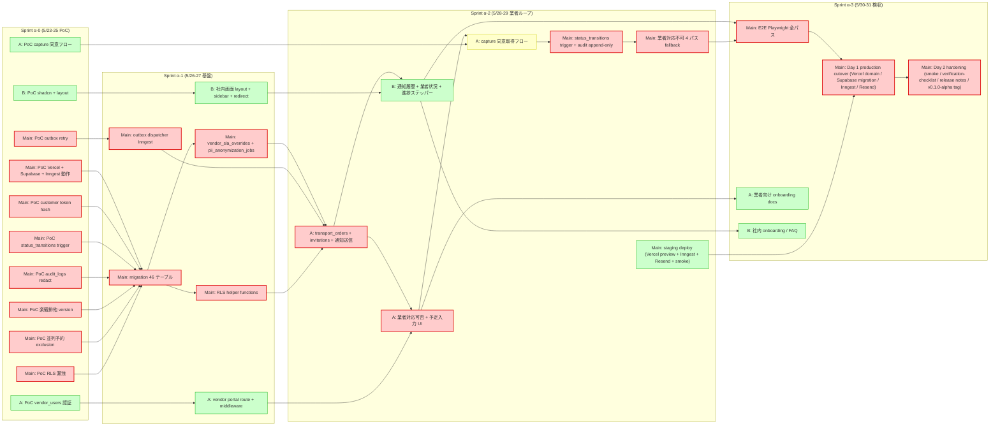

# 段取りくん 依存関係グラフ v1 (2026-05-23)

## 0. メタ
- 目的: クリティカルパス可視化と Sprint × Lane 並列化判断の根拠
- 凡例: 🔴 直列必須 (クリティカルパス) / 🟢 並列可能 / 🟡 Lane 内で直列
- 関連: roadmap.md §1 タスク表、risks.md §1 R-H-001 (PoC 未消化リスク)、dod-checklist.md §2 alpha-core 固有 DoD

## 1. クリティカルパス (alpha-core)

下記タスクのいずれか 1 つでも遅延 → alpha-core 5/31 達成不可:

🔴 Sprint α-0 PoC (RLS / 並列予約 / outbox / 楽観排他)
  ↓
🔴 Sprint α-1 migration 46 テーブル (Lane Main 専管) (※ alpha-core 必須サブセット (実装 priority P0/P1) は Tier 2 で別途確定予定)
  ↓
🔴 Sprint α-1 outbox dispatcher (Inngest function)
  ↓
🔴 Sprint α-2 業者通知 (Resend + outbox)
  ↓
🔴 Sprint α-2 vendor portal (vendor_users 認証 + capture)
  ↓
🔴 Sprint α-3 E2E (Playwright)
  ↓
🔴 Sprint α-3 Vercel 本番デプロイ + smoke

並列化不可。各タスクは前段完了後に着手。

## 2. Mermaid グラフ: Sprint × Lane × Phase

## 3. 並列可能タスク (Lane A/B どちらでも)

各 Sprint で 🟢 マーク tasks は Lane A/B どちらでも実装可。担当決めは Sprint 開始時に Lane Main が指定:

- Sprint α-0: vendor_users 認証 PoC / shadcn UI PoC / capture 同意 PoC
- Sprint α-1: portal route 骨格 / 社内 UI layout
- Sprint α-2: 社内通知履歴 UI
- Sprint α-3: 業者 onboarding docs / 社内 onboarding docs

## 4. Lane 内直列タスク (🟡)

Sprint α-2 の capture フロー は Lane A 内で `portal_resp → capture` 直列。Lane B には影響しない。

## 5. mvp-release 依存関係 (概略)

Sprint β-1〜β-4 はそれぞれ独立しており、Sprint 内クリティカルパスは:

- β-1 Phase 3 カレンダー: reservation_settings → FullCalendar 設定 → 予約枠 UI → drag move + exclusion 検証
- β-2 Phase 3 整備伝票: service_tickets CRUD → 車両管理 → partial GIN 検索
- β-3 Phase 4 顧客予約: 顧客フロー → email 認証 → 署名 token → Turnstile + rate limit
- β-4 Phase 4 通知拡張 + 整理: LINE/SMS → PII 匿名化 cron → v_accounting_audit_trail → v1.0.0 release

各 Sprint は前 Sprint 完了後に着手 (Phase 3 → 3 → 4 → 4 の順)。Sprint 内では Lane 並列可。

## 6. クリティカルパス上の代替案 (リスク発火時)

各クリティカルタスクが Sprint 内で失敗した場合の代替案 (risks.md §1 と連動):

| Critical タスク | 失敗時の代替案 |
|---|---|
| S0_RLS PoC | RLS policy 単純化、Sprint α-1 で再検証 (DDL 維持) |
| S0_outbox PoC | retry 機構を pg-cron に切替、Inngest は Phase β で再評価 |
| S1_mig | 段階適用に変更 (テーブルグループ単位)、CRITICAL なグループのみ Sprint α-1 完了 |
| S2_notify | Resend → SES 緊急切替 (Phase 4 計画を先取り) |
| S3_deploy | Vercel preview を本番扱いで一時運用 |

## 7. 関連ドキュメント
- spec/roadmap/roadmap.md - Sprint × Lane タスク詳細
- spec/roadmap/risks.md - R-H-001 〜 R-L-006 (本グラフのクリティカルパス連動)
- spec/roadmap/dod-checklist.md - Sprint 検収ゲート
- spec/data-model.md §17 - migration 順序 (S1_mig 依存)
- spec/implementation-plan.md §3 Phase 0 - PoC 16 項目

---

*v1: 2026-05-23 Claude + Codex 協調作成*
